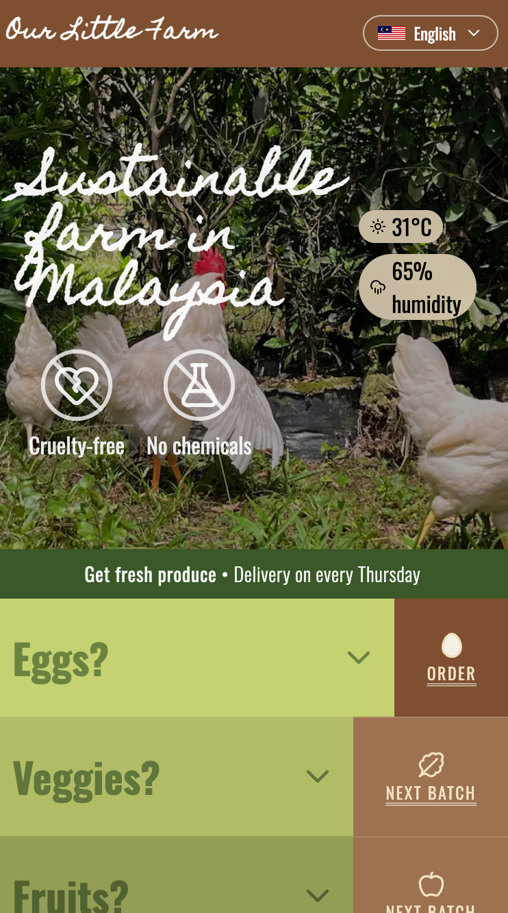

# ourlittlefarm — web frontend

A hyperlocal, animal-themed community app: a farm posts its daily updates, the
aunties buying eggs leave reviews, and the feed is bounded to the patch of map
you're actually standing in. Travel, and the feed travels with you — each post
stays anchored to where it was made.

This is the SvelteKit frontend (codename `pigweed-fe`). It talks to a separate
Bun/Hono/Prisma backend over a single typed contract. The backend stays
strictly numeric; the frontend is where it gets visual.

<p align="center">
  
</p>

## What's interesting in here

A few things I'm happy with, engineering-wise:

- **Visual state derives from data state.** This is the whole design thesis and
  it's exactly what Svelte 5 runes are good at — a post card's border grows
  "bushier" as its net score rises, posts that slipped past AI moderation get a
  rare foil treatment, low-score comments collapse. All pure reactive math off
  the API payload, no manual memoization. (`src/lib/components/PostCard.svelte`)
- **A privacy invariant the code enforces.** User location is never persisted
  server-side — the browser passes `lat`/`lng` per request and only *post* geo
  is stored. The client never sends identity-derivable params the server can get
  from the session.
- **Thin BFF, not a second backend.** The `+*.server.ts` layer resolves Better
  Auth sessions and forwards cookies (`credentials: "include"` everywhere) and
  nothing else — no DB, no domain rules. Those live in the backend, behind the
  contract.
- **Live, not polled.** Achievement unlocks arrive over an SSE stream and pop a
  toast; the coin balance updates in place. (`src/lib/realtime/`)

## Stack

- **SvelteKit + Svelte 5** (runes mode, forced project-wide) + **TypeScript**
- **GSAP** for the animation work (e.g. the step-and-dwell carousel in
  `LatestPostsStrip`)
- **Better Auth** — cookie sessions, username login, and **passkeys (WebAuthn)**
- **Paraglide JS v2** i18n — `en` / `ko` / `zh` (Traditional) / `ja`, fully
  translated, cookie-persisted
- **Tailwind v4** utilities alongside Svelte scoped styles
- Shared **Zod contract** (`@meteorclass/pigweed-contract`) as the single source
  of truth for enums and wire shapes across frontend and backend
- SEO baked in: per-route metadata, JSON-LD, and a generated `sitemap.xml`
- **Vitest** (unit + browser) and **Playwright** (e2e); deployed via
  `@sveltejs/adapter-cloudflare`

## Getting started

Requires [Bun](https://bun.sh) (`bun@1.3.13`).

```sh
bun install
bun run dev          # dev server  (-- --open to open a tab)
```

By default the app expects the backend on `http://localhost:3000`; override with
`PUBLIC_API_BASE_URL`.

### Useful scripts

| Task | Command |
|---|---|
| Dev server | `bun run dev` |
| Production build | `bun run build` |
| Preview the build | `bun run preview` |
| Typecheck | `bun run check` |
| Lint / format | `bun run lint` / `bun run format` |
| Unit tests | `bun run test:unit` |
| E2E tests | `bun run test:e2e` |

## Layout

```
src/
  lib/
    api/          # typed client + data seams (posts, users, auth)
    components/   # Avatar, PostCard, Toast, LocaleSwitcher, …
    realtime/     # SSE event stream → toasts
    paraglide/    # generated i18n (do not edit)
  routes/         # login, signup, posts, posts/new, settings, users/[id]
```

The API contract is consumed as a built package via a `file:` dependency on the
backend repo; after changing it there, rebuild it before this app sees the
change.
